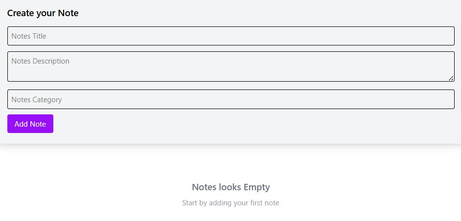

# Redux Notes App

<div align="center">
  <h1>📝 Redux Notes App</h1>
    
  </a>
</div>
A simple and efficient React application to manage daily notes using Redux Toolkit for state management and Tailwind CSS for styling.

## ✨ Features
*   **Create Notes:** Add notes with a title, description, and specific category.
*   **Global State:** Uses Redux Toolkit to manage notes across the application.
*   **Real-time List:** Automatically updates the notes list upon adding or deleting.
*   **Timestamps:** Every note displays its creation date and time.
*   **Responsive Design:** Fully responsive layout using Tailwind CSS.
*   **Empty State handling:** Informative UI when no notes are present.

## 🛠️ Tech Stack
*   **Frontend:** React 19
*   **State Management:** Redux Toolkit (@reduxjs/toolkit)
*   **Styling:** Tailwind CSS 4
*   **Build Tool:** Vite

## ⚙️ Installation & Setup

1. **Clone the repository:**
   ```bash
   git clone <your-repository-url>
   ```

2. **Install dependencies:**
   ```bash
   npm install
   ```

3. **Start the development server:**
   ```bash
   npm run dev
   ```

## 📂 Project Structure
*   `src/redux/notesSlice.js`: Contains the logic for adding and deleting notes.
*   `src/components/NotesForm.jsx`: The input component for creating new notes.
*   `src/components/NotesList.jsx`: Displays the grid of saved notes.
*   `src/redux/store.js`: The central Redux store configuration.

## 📝 Future Enhancements
*   Add **Edit/Update** functionality.
*   Implement **LocalStorage** to persist data on page refresh.
*   Add **Search & Filter** by category.
